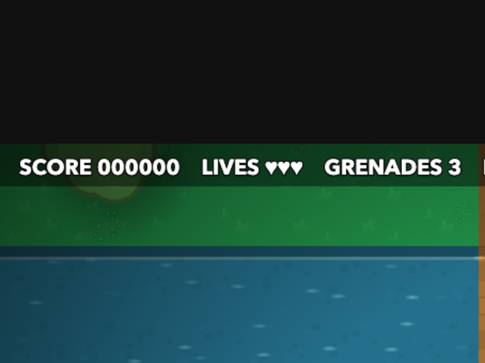

日本語版: [README.ja.md](README.ja.md) · Japanese handouts: [workshop/ja/](workshop/ja/README.md)

# Commando Workshop

A small top-down, vertically scrolling shooter used as the starter for a hands-on workshop on
building game scaffolding with AI coding agents (Claude Code, Codex, OpenCode).



## Run

```sh
pnpm install
pnpm dev
```

Controls: **WASD** move · **mouse** aim · **click** fire · **Space / right-click** grenade · **R** restart.

Rescue the POWs, reach the top. Bunkers and tanks shrug off bullets: use grenades, or a nearby red barrel.

## Exercise 2: data + editor

The level and the enemies are TOML files in `data/`, and the page has an editor next to the game.

- **Edit the map:** pick *Terrain* or *Units*, choose from the palette, click or drag on the map. Shift-drag fills a rectangle,
  right-click picks what is under the cursor, undo/redo with ⌘Z / ⇧⌘Z. Click a row number to choose where *Play from row* starts.
  The blue frame on the map is what the game is showing; the yellow dot is the player.
- **Edit the enemies:** the *Enemies* tab has a form for every type: stats, one movement primitive, one attack primitive.
  *Clone as new type* makes a new one (say a faster sniper) without touching code.
- **Save** (⌘S) writes `data/levels/<name>.toml` / `data/enemies.toml` and the game reloads. Files changed by anything else
  (a text editor, a coding agent) reload the same way; if the file is invalid the game keeps running the last good version and
  the panel shows what is wrong. `pnpm check:data` validates the files from the command line.
- **Levels:** the dropdown switches level (`?level=name` in the URL); *New…* creates a blank one.
- **Dev only:** the editor and the file API are part of `pnpm dev`; `pnpm build` produces a game that cannot load levels.

File formats are documented at the top of each data file and in `AGENTS.md`.

## This branch: exercise 3, an agent in the editor

The *Ask an agent* section at the top of the editor's Map tab edits the map from a sentence.

1. **Choose what it may touch:** drag on the row numbers to select rows (or leave it as the whole map), and tick whether terrain, units or both may change.
   *Game view* selects the rows currently on screen.
2. **Ask** (⌘↵): the dev server builds a prompt (rules, legend, what each enemy does, the whole map, your selection, your last few requests)
   and runs your coding-agent CLI headlessly: `claude -p`, `codex exec` or `opencode run`, chosen in the dropdown. You can keep playing while it works.
3. **Review:** the answer is checked (valid codes, a walkable route, units on walkable cells, tank footprints on road, nothing next to the spawn, ...).
   If a check fails the problems go back to the agent for another try, up to three. A passing answer is **previewed on the map** with the changed
   cells outlined; *Hold to see original* peeks at the before. **Accept** applies it as an ordinary undoable edit; then Save as usual. **Reject** drops it.
4. **If it can't be done** with the terrain, units and behaviours that exist ("add a helicopter boss"), the agent says so and the request is appended
   to `data/requests.md`, ready to hand to a coding session.

The agent is a stateless function here: the page owns the level, the history (`data/ask_log.jsonl`) and the validation. The CLIs run in an empty
temporary directory with tools off (Claude) or a read-only sandbox (Codex), so all they can do is answer with text.

Typical latency on one machine with the 12 KB prompt: Claude Code with its default model ~40 s, with `sonnet` ~19 s; Codex ~44 s.
Put a model name in the field next to the CLI choice to trade quality for speed. Try a CLI from the command line before relying on it:

```sh
pnpm try:agent claude "add a sniper nest on the right with cover" 30 56 sonnet
pnpm test:ask      # the loop against scripted fake agents; no network
```

## The exercises

Handouts are in `workshop/` (start with `workshop/README.md`).

1. **Hard-coded** (`main`): the level is a text grid in `src/level.ts`, behaviours are code. Add features and effects.
2. **Data + editor** (finished version on the `exercise-2` branch): the level and the enemy definitions move to TOML files, with a level editor and hot reload.
3. **Agent in the editor** (this branch, the finished version): the editor calls a headless coding agent to edit the level on request.

## Credits

Sprites and tiles: [Kenney](https://kenney.nl) — *Top-down Shooter* and *Top-Down Tanks*, CC0.

## Licence

The code and handouts are [MIT](LICENSE) licensed. The sprites and tiles keep their own CC0 licence (`public/assets/licenses/`).
